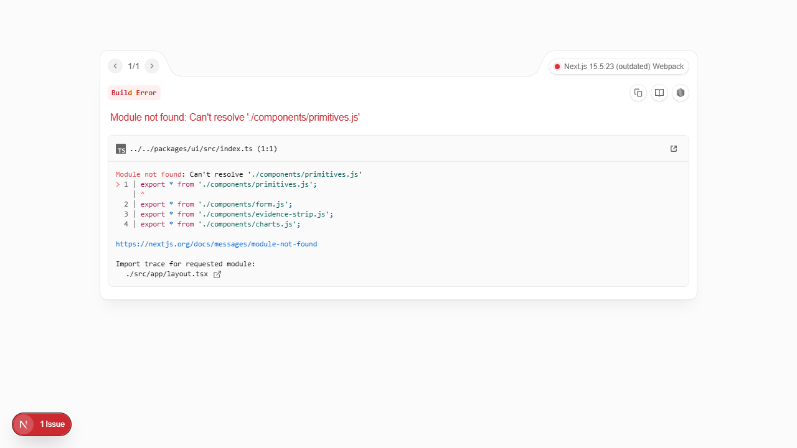

# Beyond the Obvious AI Student Lab

**Learn to frame the problem, build the smallest useful solution, and prove it works.**

[](https://github.com/tktarun03/beyond-obvious-ai-student-lab/actions/workflows/ci.yml)
[](LICENSE)
[](https://www.typescriptlang.org/)

An open learning monorepo with **ten complete engineering prompt exercises**, a working
catalogue portal, reusable engineering packages, and five AI project scaffolds to build on.
Examples span India and global teams. The default path runs locally without paid AI keys.

Created by [Arunkumar Thamilarasu / @tktarun03](https://github.com/tktarun03) for
[Beyond the Obvious / @BeyondObviousArun](https://www.youtube.com/@BeyondObviousArun).
**Question. Explore. Rethink.**

> **Community shout-out:** To students in Tamil Nadu, across India and around the world,
> and every teacher, engineer, tester and translator helping them learn: thank you.
> Try an exercise, share what failed, and help the next learner. [Join in →](COMMUNITY.md)

## Start in five minutes

Use Node.js 22 or 24 with npm. The package minimum remains Node.js 20.11; CI checks 22 and 24.

```bash
git clone https://github.com/tktarun03/beyond-obvious-ai-student-lab.git
cd beyond-obvious-ai-student-lab
npm ci
npm run dev
```

Open [the catalogue](http://localhost:3000) or [the prompt lab](http://localhost:3000/prompt-lab).
The default setup uses mock AI, in-memory storage and development authentication.
No environment file is needed for the offline prompt lab.

Prefer the terminal?

```bash
npm run astra -- --list
npm run astra -- --demo 01-payment-retry
npm run astra -- --demo 02-exam-portal --json
```

These commands print reusable prompts with synthetic evidence. They do not call a
model, configure ChatGPT settings or incur model charges. Paste a prompt into your
chosen assistant and check its answer against the included rubric.

## Pick a learning path

| I want to…                          | Start here                                                                                      |
| ----------------------------------- | ----------------------------------------------------------------------------------------------- |
| Use Astra effectively               | [Prompt lab guide](docs/gpt-6-astra/README.md) and [cheatsheet](docs/gpt-6-astra/CHEATSHEET.md) |
| Practice a real engineering problem | [Ten demos with complete sample inputs](docs/gpt-6-astra/10-LIVE-DEMO-PROMPTS.md)               |
| Compare quality, effort and cost    | [Evaluation workbook](docs/gpt-6-astra/EVALUATION.md)                                           |
| Run a college/community session     | [60-minute workshop](docs/gpt-6-astra/WORKSHOP.md)                                              |
| Build a portfolio project           | [Learning path](docs/learning-path/README.md)                                                   |
| Understand the code                 | [Architecture](docs/architecture/README.md)                                                     |
| Explain my work in interviews       | [Interview guide](docs/interview-guide/README.md)                                               |
| Run or host an app                  | [Deployment notes](docs/deployment/README.md)                                                   |
| Contribute or translate             | [Contributing](CONTRIBUTING.md) and [Community](COMMUNITY.md)                                   |

## What works today

| Area                    | Status                                                                         |
| ----------------------- | ------------------------------------------------------------------------------ |
| Catalogue portal        | Working Next.js UI                                                             |
| Engineering prompt lab  | Ten searchable exercises; copy-ready prompts; CLI text/JSON export             |
| Shared packages         | Auth, validation, AI/database boundaries, observability, UI and tests          |
| Offline verification    | Docs checks, lint, typecheck, unit tests, smoke evals and portal browser tests |
| Five project apps       | **Scaffolds**: product pages and complete workflows still need implementation  |
| Live-model benchmarking | **Not included**: human review rubrics and a measurement template are provided |

A successful build does not make a scaffold a finished product. The current project
smoke evals validate their framework wiring; they do not measure a live model's quality.



## Ten exercises, one reusable workflow

| India-focused                            | Global engineering                |
| ---------------------------------------- | --------------------------------- |
| Angular payment retry and idempotency    | React modal accessibility         |
| Exam-results traffic and private caching | Multi-region SaaS recovery        |
| Payment recovery after disconnection     | Node.js latency diagnosis         |
| Multi-warehouse delivery rules           | Legacy Java modernization         |
|                                          | Pull-request authorization review |
|                                          | Blameless incident postmortem     |

Each exercise includes a weak prompt, a complete synthetic fixture, constraints,
success criteria, four answer checks and a stretch task. The portal and CLI share
[one scenario source](examples/gpt-6-astra/scenarios.ts).

The [effort router](examples/gpt-6-astra/astra-prompt-router.ts) is an explainable
teaching heuristic. It can suggest deterministic code, benchmarking an efficient
model, or an Astra effort. It is not an official model recommendation, a safety
boundary or a measured optimum. [Model sources and freshness](docs/gpt-6-astra/SOURCES.md).

## Five projects to build

| Project                            | Port | First useful outcome                                              |
| ---------------------------------- | ---- | ----------------------------------------------------------------- |
| AI Knowledge Copilot               | 3001 | Answer from a small document set with verifiable source citations |
| Document Intelligence              | 3002 | Extract typed fields and route uncertain data to review           |
| India Multilingual Voice Assistant | 3003 | Extract intent/slots and confirm before a consequential action    |
| Software Engineering Agent         | 3004 | Review a diff and propose an evidence-backed patch                |
| Data Decision Assistant            | 3005 | Validate CSV data and separate observations from interpretations  |

`npm run dev:01` through `npm run dev:05` start the corresponding workspaces.
They currently have no product pages; an initial scaffold/404 response is expected.
Choose one small vertical slice and follow the [learning milestones](docs/learning-path/README.md).

## Repository map

| Path                                    | Purpose                                                        |
| --------------------------------------- | -------------------------------------------------------------- |
| `apps/portal`                           | Catalogue, prompt lab and browser tests                        |
| `examples/gpt-6-astra`                  | Pure helpers, CLI, scenario fixtures and manual evaluation CSV |
| `projects/01-*` through `05-*`          | Learner app scaffolds and deterministic smoke evals            |
| `packages/ai`                           | Provider seam, mock/optional live adapter and eval framework   |
| `packages/auth` / `database`            | Session, ownership and storage boundaries                      |
| `packages/validation` / `observability` | Input/environment checks, logs, spans and usage metering       |
| `packages/ui` / `shared`                | Tokens, UI primitives, errors and utilities                    |
| `docs`                                  | Guides, workshop, episode script and source notes              |
| `.github`                               | CI, bug/contribution forms and PR template                     |

## Useful commands

| Command                                       | Purpose                                                    |
| --------------------------------------------- | ---------------------------------------------------------- |
| `npm run dev`                                 | Start the portal at port 3000                              |
| `npm run astra -- --list`                     | List the ten exercises                                     |
| `npm run astra -- --demo 08-pr-review --json` | Export a complete prompt plus review criteria              |
| `npm run astra:check`                         | Check the offline router, catalogue and CLI                |
| `npm run verify`                              | Docs destinations, lint, types, unit tests and smoke evals |
| `npm run build`                               | Build all workspaces                                       |
| `npm run e2e -- --project=portal`             | Start the portal and run browser journeys                  |
| `npm run test:watch`                          | Watch unit tests during a code change                      |
| `npm run docs:check`                          | Check local Markdown destinations, without network calls   |
| `npm run format:check`                        | Check repository formatting                                |

Before browser tests, run `npx playwright install chromium` (on Linux CI, use
`--with-deps`). CI uses mock mode, no model credentials and read-only repository permissions.

## Environment and troubleshooting

See [.env.example](.env.example) for optional settings. Next.js loads environment files
from the **app workspace**, so copy the example to `apps/portal/.env.local` or the chosen
project's `.env.local` when overrides are needed. A root `.env.local` is not automatically
loaded by these workspace commands. Shell-run CLI scripts need explicit environment setup.

| Problem                  | Check                                                                            |
| ------------------------ | -------------------------------------------------------------------------------- |
| A module is missing      | Run `npm ci` from the monorepo root                                              |
| A project returns 404    | It is a scaffold; implement its page/layout and first workflow                   |
| Unknown Astra demo ID    | Run `npm run astra -- --list` and use an exact ID                                |
| Clipboard is unavailable | Use the selected prompt text and your device's copy command                      |
| Playwright cannot launch | Install Chromium and the required system dependencies                            |
| Live AI/Firebase fails   | Verify optional SDK setup, server-side credentials and account access separately |

The optional live provider in the shared AI package is Gemini; the Astra module is an
offline teaching tool. Passing mock checks does not verify a live integration.
Never expose credentials through `NEXT_PUBLIC_*`. Use synthetic inputs in public contributions.

## Contribute and share

Good next steps include a reviewed Tamil explanation, a regression case, an accessibility
improvement, or one complete project slice with an honest demo and limitations.
[Open an issue](https://github.com/tktarun03/beyond-obvious-ai-student-lab/issues/new/choose),
[send a PR](CONTRIBUTING.md), or share the repo with a coding club. If it helped you, a
star makes it easier for others to discover.

Read [community conduct](CODE_OF_CONDUCT.md) and [security reporting](SECURITY.md).
This is a personal educational project, not an official OpenAI resource or an employer
publication. Views are the creator's own. [MIT license](LICENSE).
